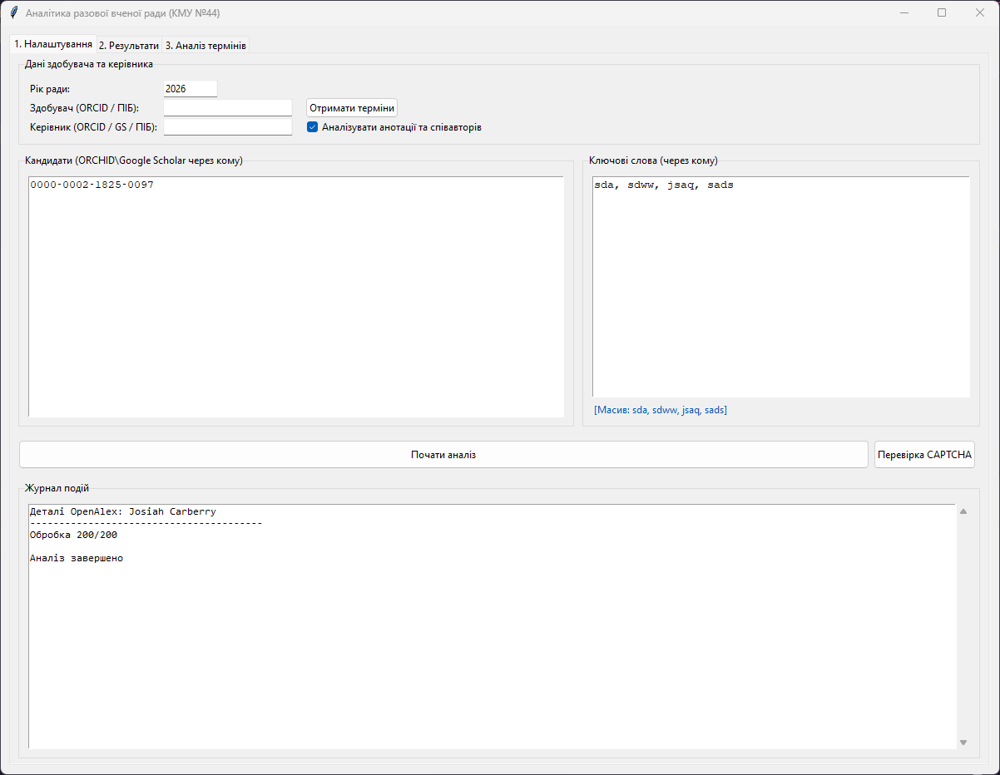
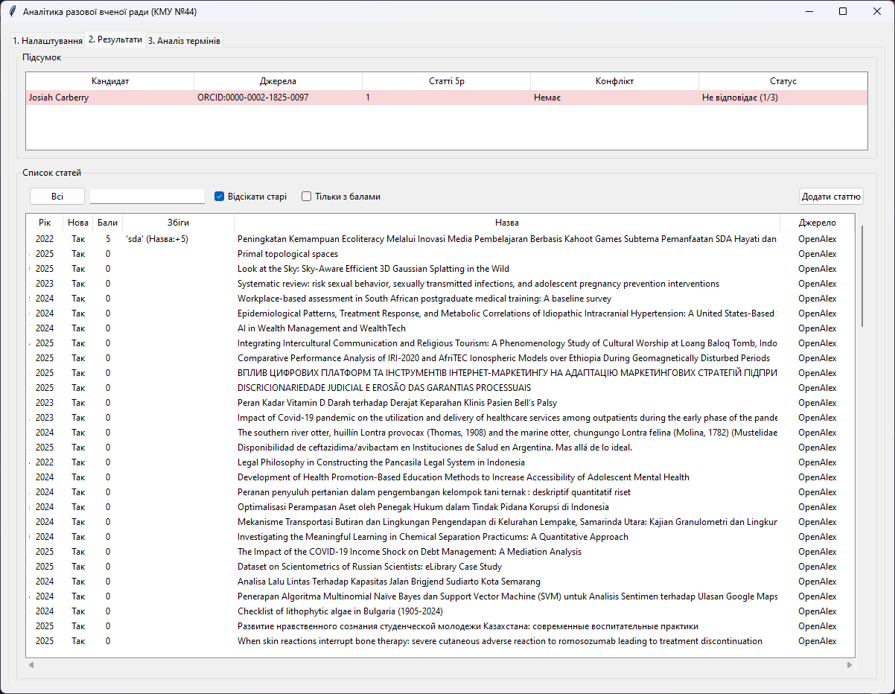
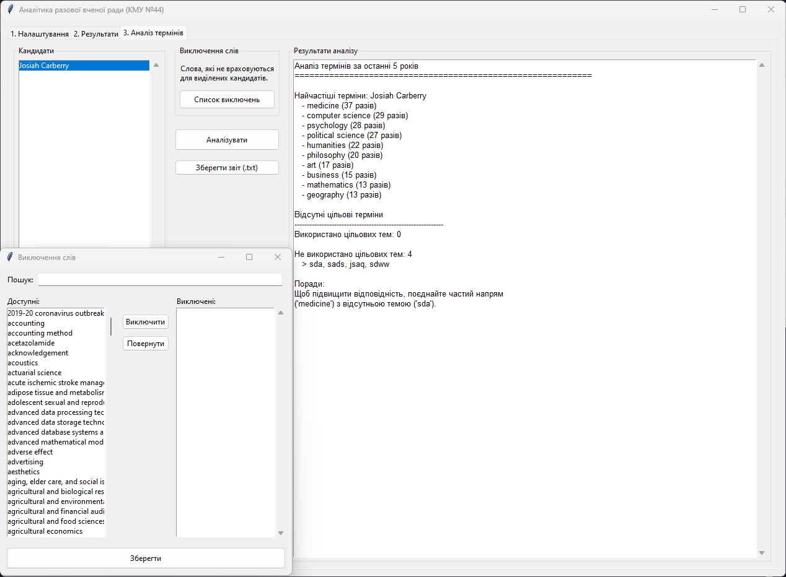

# Аналітика разової вченої ради (КМУ №44)

Додаток для збору та аналізу наукового доробку кандидатів у члени разових вчених рад. Програма перевіряє публікації на відповідність визначеній тематиці згідно з вимогами МОН України.

## Основні можливості
- **Агрегація даних:** Збір публікацій з профілів ORCID, баз OpenAlex та Google Scholar.
- **Оцінка релевантності:** Аналіз назв, анотацій та ключових слів статей.
- **Аналіз термінів:** Виявлення найбільш вживаних термінів автора та формування рекомендацій щодо необхідних ключових слів для майбутніх статей.
- **Фільтрація:** Можливість виключення певних слів з аналізу для кожного кандидата індивідуально.
- **AI консультант:** чат-інтерфейс для аналізу кандидатів з можливістю пошуку в інтернеті та отримання рекомендацій.
- **OpenAlex інтеграція:** автоматичний збір даних про публікації авторів.
- **Збереження сесій:** можливість зберегти та відновити стан аналізу з PIN-захистом.
- **Артефакти:** відображення рекомендацій, підсумків та порівнянь у зручному форматі.

---

## Інструкція з використання

### Крок 1: Налаштування аналізу
1. Відкрийте программу.
2. Введіть **Рік ради** (програма автоматично розрахує період у 5 років до цієї дати).
3. Введіть **ORCID здобувача** та натисніть **"Ключові слова"** для підбору ключових слів з його останніх статей (або введіть ключові слова вручну в поле "Цільові терміни").
4. Введіть ідентифікатори (ORCID або Scholar ID) у поле **"Кандидати"**, розділяючи їх комою. Кожен новий кандидат — з нового рядка.
5. (Опціонально) Вкажіть ORCID/Scholar ID керівника для перевірки на конфлікт інтересів.
6. Натисніть **"Почати аналіз"** і дочекайтеся завершення (процес відображається в Журналі подій).
7. Після завершення аналізу стане доступний **AI консультант** для додаткової перевірки кандидатів.



### Крок 2: Перегляд результатів
1. Перейдіть на вкладку **"2. Результати"**.
2. У верхній таблиці відображається загальний підсумок по кожному кандидату (Статус, кількість релевантних статей, наявність конфлікту).
3. Натисніть на будь-якого кандидата у верхній таблиці, щоб відфільтрувати його статті в нижньому списку.
4. **Деталі статті:** Натисніть на статтю правою кнопкою миші та виберіть **"Деталі"**, щоб переглянути анотацію, список авторів, журнал та ключові слова.
5. **Ручні ключові слова:** Для додавання власних ключових слів скористайтеся відповідним пунктом правого меню ("Редагувати ключові слова").



### Крок 3: Аналіз термінів
1. Перейдіть на вкладку **"3. Аналіз термінів"**.
2. Оберіть одного або декількох кандидатів у списку зліва.
3. Натисніть **"Список виключень"**, якщо потрібно прибрати з аналізу певні слова (наприклад: "analysis", "method").
4. Натисніть **"Аналізувати"**, щоб отримати текстовий звіт. Звіт містить статистику частоти слів, перетин інтересів (якщо авторів декілька) та рекомендації щодо цільових термінів.
5. Для збереження результату натисніть **"Зберегти звіт (.txt)"**.
6. Для додаткових рекомендацій використайте **AI консультант** — він надасть детальніший аналіз на основі зібраних даних.



---

## AI консультант

Після завершення аналізу стає доступним AI консультант — чат-інтерфейс для додаткової перевірки кандидатів.

### Можливості
- **Чат з AI:** Здійснюйте пошук публікацій, отримуйте рекомендації та порівняння кандидатів безпосередньо в чаті.
- **Веб-пошук:** Автоматичний пошук додаткової інформації про кандидатів в інтернеті.
- **Артефакти:** Результати AI відображаються у зручному форматі: рекомендації (зелений), підсумки (синій), порівняння (червоний), результати пошуку (оранжевий).
- **PIN-захист:** Доступ до AI консультанта захищено PIN-кодом.

### Використання
1. Натисніть кнопку **"AI консультант"** на панелі інструментів.
2. Введіть PIN-код (встановлюється при першому запуску в налаштуваннях AI).
3. У вікні чату вводьте запитання українською або іншими мовами.


---

## Збереження та завантаження сесій

### Збереження сесії
1. Виберіть **Файл → Зберегти сесію** (або Ctrl+S).
2. Введіть PIN-код для захисту API ключів.
3. Оберіть місце збереження файлу (.acmp).

Сесія містить: усі налаштування, кандидатів, зібрані публікації, ключові слова та стан аналізу.

### Завантаження сесії
1. Виберіть **Файл → Завантажити сесію** (або Ctrl+O).
2. Оберіть раніше збережений файл (.acmp).
3. Сесія відновиться з усіма даними.


---

## OpenAlex інтеграція

Програма автоматично використовує базу OpenAlex для отримання даних про публікації авторів.

### Переваги
- Швидкий збір великої кількості публікацій
- Детальна інформація: анотації, ключові слова, журнали
- Підтримка пошуку авторів за іменем або ORCID

Дані OpenAlex використовуються автоматично під час аналізу кандидатів разом з ORCID та Google Scholar.


---

## Встановлення та запуск (з вихідного коду)
1. Переконайтеся, що встановлено Python 3.8 або новішої версії.
2. Склонуйте репозиторій та перейдіть у папку з проєктом:
   ```bash
   git clone 
   cd academic-match
   ```
3. Створіть та активуйте віртуальне середовище:
   ```bash
   python -m venv .venv
   .venv\Scripts\activate  # Для Windows
   ```
4. Встановіть залежності:
   ```bash
   pip install -r requirements.txt
   ```
5. Запустіть скрипт:
   ```bash
   python academ_back.py
   ```
